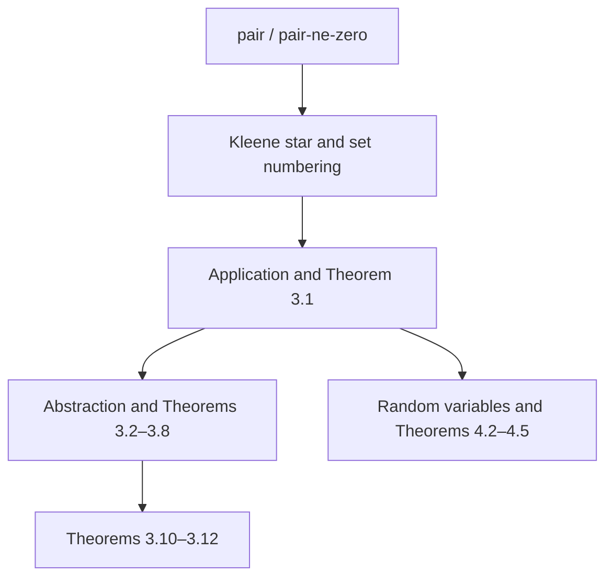

# Formalization of Scott's Stochastic λ-Calculi in Agda

**Authors.** Lars Warren Ericson (independent researcher, d/b/a Catskills
Research Company; lars.ericson@catskillsresearch.com) and Dana S. Scott
(Computer Science Department, Carnegie Mellon University, Emeritus).
**Technical report.** CMU-CS-26-XXX, School of Computer Science, Carnegie
Mellon University, Pittsburgh, PA 15213.
**Source paper.** Dana S. Scott, *Stochastic λ-calculi: An extended
abstract*, Journal of Applied Logic 12 (2014), 369–376 (PROGIC 2013).
**Repository.** https://github.com/catskillsresearch/scott2013
**Cross-archive.** This report will also be deposited on arXiv in cs.LO and
math.LO.

---

## Abstract

Scott's PROGIC 2013 extended abstract *Stochastic λ-Calculi* expands the
graph model of untyped λ-calculus so that enumeration operators on
$\mathcal{P}(\mathbb{N})$ interpret both ordinary combinators and random
algorithms. Application is continuous, every continuous map has a largest
graph, and $\lambda$-abstraction preserves continuity and computability. The
same space is injective and contains a homeomorphic copy of every countably
based $T_0$-space. Random variables valued in $\mathcal{P}(\mathbb{N})$ are
closed under application, so $\lambda$-terms become stochastic programs;
regular and probabilistic languages appear as special cases. This report
records an Agda formalization of that development, beginning with Scott's
pairing function. The library is checked with `agda --safe` and introduces
no postulates. Large-language-model assistance is used in drafting; every
accepted declaration is typechecked. Source and build scripts accompany the
report.

## 1. Introduction and Historical Context

### 1.1 Historical context

The graph model identifies continuous operators on $\mathcal{P}(\mathbb{N})$
with sets of integers via enumeration operators of Myhill–Shepherdson and
Friedberg–Rogers. Scott defined the model in the mid-1970s; Plotkin had
given a closely related set-theoretic construction earlier. The 2013
abstract recycles that model as a programming language for recursive
function theory and then adds random combinators.

This formalization is a standalone Agda development of the 2013/2014
abstract. It does not import the sibling formalizations of Scott 1972, 1976,
or 2026, though those papers supply historical and later context.
This formalization was undertaken after Dana S. Scott suggested the paper as
a target for mechanization.

### 1.2 Retrospective Remarks by Dana S. Scott

> **Editorial placeholder.** Prof. Scott's approved retrospective remarks will
> be inserted here before publication. No language is attributed to him in this
> draft.

## 2. Mathematical Background

### 2.1 Pairing, sequences, and Kleene star

Scott numbers pairs by $(n,m)=2^n(2m+1)$. Sequences use
$\langle\rangle=0$ and a recursive cons
$\langle n_0,\dots,n_k\rangle=(\langle n_0,\dots,n_{k-1}\rangle,n_k)$.
Finite sets use $\mathrm{set}(0)=\emptyset$ and
$\mathrm{set}((n,m))=\mathrm{set}(n)\cup\{m\}$. Kleene star is
$X^*=\{n\mid \mathrm{set}(n)\subseteq X\}$.

The current library encodes pairing and proves that pairs are nonzero, so
that $0$ remains available for the empty sequence:

```agda
pair : ℕ → ℕ → ℕ
pair n m = 2 ^ n * suc (m + m)

pair-ne-zero : (n m : ℕ) → pair n m ≢ 0
```

### 2.2 Enumeration operators and the graph model

Definition 2.1 sets $F(X)=\{m\mid \exists n\in X^*.\ (n,m)\in F\}$.
Theorem 3.1 asserts continuity of application in both arguments.
Theorem 3.2 supplies a largest graph for every continuous
$\Phi:\mathcal{P}(\mathbb{N})\to\mathcal{P}(\mathbb{N})$. Definition 3.3
and Theorems 3.4–3.8 give $\lambda$-abstraction, lattice identities, and
the least-fixed-point combinator $\nabla=\lambda X.\Phi(X(X))$.

### 2.3 Random variables

A random variable is a map $X:[0,1]\to\mathcal{P}(\mathbb{N})$ whose
coordinate events are Lebesgue measurable (Definition 4.1). Theorem 4.2
closes this class under pointwise application. Theorems 4.4 and 4.5 recover
regular and probabilistic languages from a sequentializer combinator.

## 3. Agda Architecture and Design Decisions

### 3.1 Scope and module layout

The bootstrap library is small:

| Module | Role |
| --- | --- |
| `Scott2013.GraphModel.Basic` | Pairing function and `pair-ne-zero` |

Later modules will add Kleene star, application, abstraction, injectivity,
and random variables.

### 3.2 Builtin naturals

The pairing module is self-contained: it uses `Agda.Builtin.Nat` and
`Agda.Builtin.Equality` only. Scott's pairing is not a Cantor pairing; the
formalization uses the paper's exact formula $2^n(2m+1)$, written
`2 ^ n * suc (m + m)`.

### 3.3 Proof dependency structure

<!-- figure-caption: Intended library layers: encodings, graph-model λ-calculus, then random variables. -->


Solid arrows are planned dependencies. Only the pairing node is implemented.

### 3.4 Verified theorem inventory

| Paper result | Agda name | Status |
| --- | --- | --- |
| §2 pairing | `pair` / `pair-ne-zero` | Proved |
| Theorem 3.1 | *(pending)* | Application is continuous |
| Theorem 3.2 | *(pending)* | Largest graph of a continuous map |
| Definition 3.3 / Theorems 3.4–3.8 | *(pending)* | Abstraction, lattice laws, least fixed point |
| Theorems 3.10–3.12 | *(pending)* | $T_0$ embedding and injectivity of $\mathcal{P}(\mathbb{N})$ |
| Theorems 4.2, 4.4, 4.5 | *(pending)* | Random application and languages |

## 4. Verification and Automated Pipeline

### 4.1 Typechecking and reproducible build

The development is checked with Agda `--safe` (locally Agda 2.6.3).

```bash
bash scripts/build_agda.sh
bash scripts/generate_arxiv_with_code.sh
```

Regenerate the PDF and arXiv zip with `bash scripts/build_arxiv_pdf.sh`.

### 4.2 LLM-assisted drafting and interactive proof verification

Large language models assist with transcription, scaffolding, and this
report. Outputs are provisional until Agda accepts them. No large language
model is listed as an author.

## 5. Discussion and Future Work

Immediate work is to lock the numbered theorems rather than only the pairing
encoding. The 1976 graph-model paper and the 2026 domain-valued
random-variable development are related but remain separate repositories.

## Code Availability and Archival

The complete Agda development, report source, and build scripts are at
the public GitHub repository named `scott2013` under
`catskillsresearch`. This version is being prepared as Carnegie Mellon
University School of Computer Science Technical Report **CMU-CS-26-XXX**
and will be cross-archived on arXiv under **cs.LO** and **math.LO**.

### License and source PDF

Original Agda code and author-written documentation are Apache-2.0. The
source paper PDF and its transcription are not Apache-2.0; see the
repository `NOTICE` and source-material README for the copyright carve-out.

## Acknowledgments

### AI-assisted development

Agda in this repository was drafted with AI-agent assistance under Lars
Warren Ericson's direction and review. The human authors retain
responsibility for the mathematical content, the formalization route, and
every formal claim. **No large language model is listed as a co-author.**

We gratefully acknowledge assistance from the following tools:

<!-- AI_MODEL_TOOL_BULLETS -->
<!-- /AI_MODEL_TOOL_BULLETS -->

## References

- **[Sco14]** D. S. Scott. *Stochastic λ-calculi: An extended abstract*.
  Journal of Applied Logic **12** (2014), 369–376.
- **[Sco76]** D. S. Scott. *Data types as lattices*. SIAM Journal on
  Computing **5** (1976), 522–587.
- **[Plo93]** G. D. Plotkin. *Set-theoretical and other elementary models of
  the λ-calculus*. Theoretical Computer Science **121** (1993), 351–409.

<!-- AI_MODEL_REFERENCES -->
<!-- /AI_MODEL_REFERENCES -->
