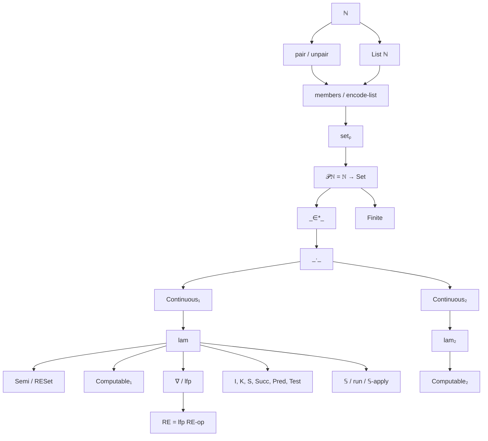
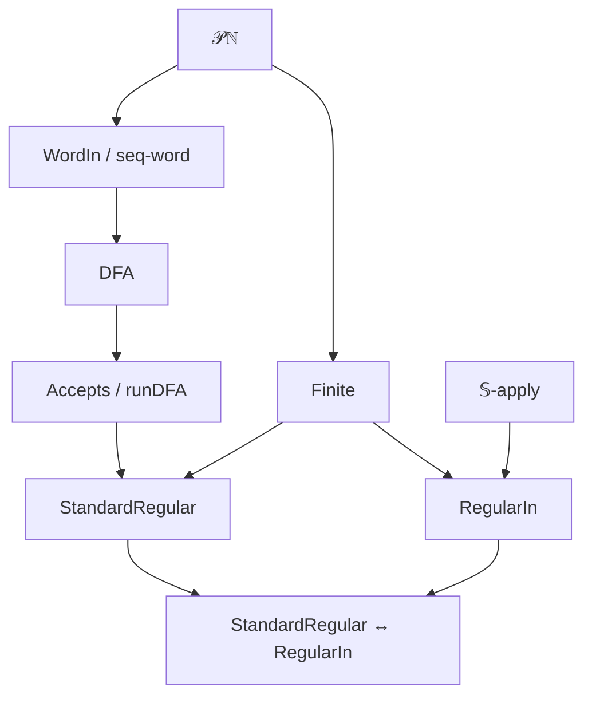
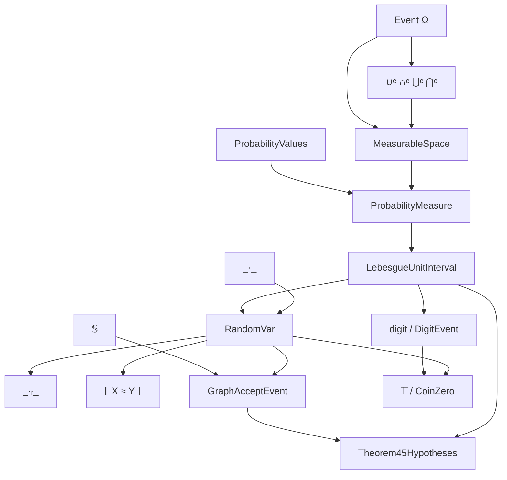
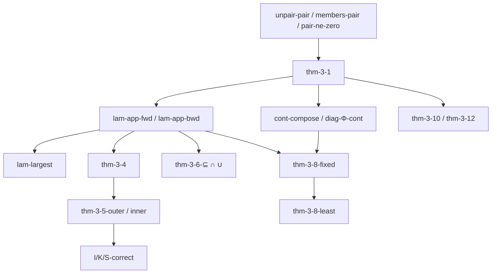
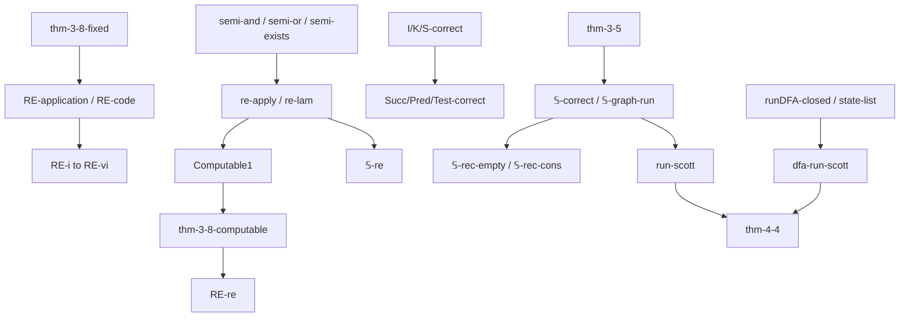
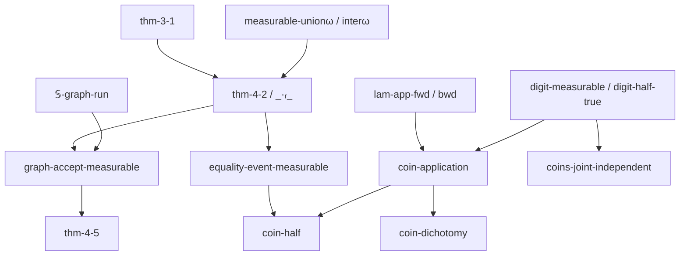
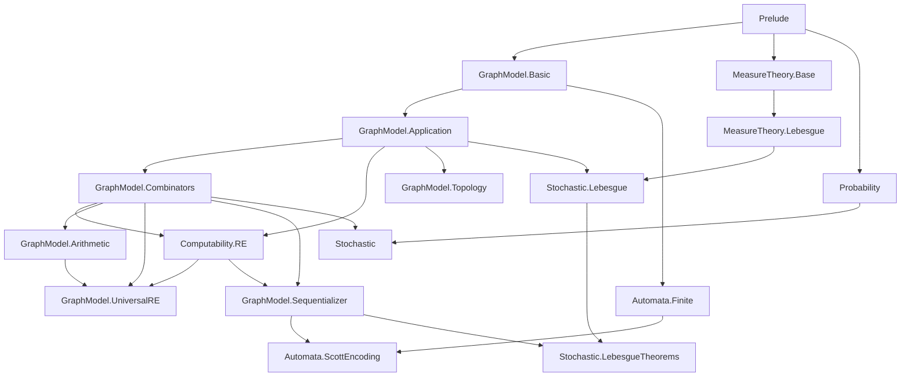

# Formalization of Scott's Stochastic λ-Calculi in Agda

**Authors.** Lars Warren Ericson (independent researcher, d/b/a Catskills
Research Company; lars.ericson@catskillsresearch.com) and Dana S. Scott
(Computer Science Department, Carnegie Mellon University, Emeritus).
**Technical report.** CMU-CS-26-XXX, School of Computer Science, Carnegie
Mellon University, Pittsburgh, PA 15213.
**Source paper.** Dana S. Scott, *Stochastic λ-calculi: An extended
abstract*, Journal of Applied Logic 12 (2014), 369–376 (PROGIC 2013).
**Repository.** https://github.com/catskillsresearch/scott2013
**Cross-archive.** This report will also be deposited on arXiv in cs.LO and
math.LO.

---

## Abstract

Scott's PROGIC 2013 extended abstract *Stochastic λ-Calculi* expands the
graph model of untyped λ-calculus so that enumeration operators on
$\mathcal{P}(\mathbb{N})$ interpret both ordinary combinators and random
algorithms. Application is continuous, every continuous map has a largest
graph, and $\lambda$-abstraction preserves continuity and computability. The
same space is injective and contains a homeomorphic copy of every countably
based $T_0$-space. Random variables valued in $\mathcal{P}(\mathbb{N})$ are
closed under application, so $\lambda$-terms become stochastic programs;
regular and probabilistic languages appear as special cases. This report
records an Agda formalization of that development, beginning with Scott's
pairing function. The library is checked with `agda --safe` and introduces
no postulates. Large-language-model assistance is used in drafting; every
accepted declaration is typechecked. Source and build scripts accompany the
report.

## 1. Introduction and Historical Context

### 1.1 Historical context

The graph model identifies continuous operators on $\mathcal{P}(\mathbb{N})$
with sets of integers via enumeration operators of Myhill–Shepherdson and
Friedberg–Rogers. Scott defined the model in the mid-1970s; Plotkin had
given a closely related set-theoretic construction earlier. The 2013
abstract recycles that model as a programming language for recursive
function theory and then adds random combinators.

This formalization is a standalone Agda development of the 2013/2014
abstract. It does not import the sibling formalizations of Scott 1972, 1976,
or 2026, though those papers supply historical and later context.
This formalization was undertaken after Dana S. Scott suggested the paper as
a target for mechanization.

### 1.2 Retrospective Remarks by Dana S. Scott

> **Editorial placeholder.** Prof. Scott's approved retrospective remarks will
> be inserted here before publication. No language is attributed to him in this
> draft.

## 2. Tour of the Formalization

This section follows the paper's order.  Definition excerpts show the
complete computational gist; theorem excerpts show the checked statement
and the proof's principal construction rather than reproducing long
transport calculations.  Names such as `Σ`, `×`, and `↔` are supplied by
the local K-free prelude.

### 2.1 Pairing, sequence numbers, finite sets, and star

Scott's exact pairing is used.  Zero remains the empty sequence;
`members` decodes cons-codes, while `setₚ n` and star are literally
finite-list membership and $\mathrm{set}(n)\subseteq X$.

```agda
pair : ℕ → ℕ → ℕ
pair n m = 2 ^ n * suc (m + m)

members : ℕ → List ℕ
members-zero : members zero ≡ []
members-pair : ∀ n m → members (pair n m) ≡ m ∷ members n
unpair-pair : ∀ n m → unpair (pair n m) ≡ (n , m)

𝒫ℕ : Set₁
𝒫ℕ = ℕ → Set
setₚ : ℕ → 𝒫ℕ
setₚ n m = m ∈-list members n
_∈*_ : ℕ → 𝒫ℕ → Set
n ∈* X = All X (members n)
```

### 2.2 Definitions 2.1 and 2.2: application and continuity

Definition 2.1 carries the finite input witness, its star proof, and the
graph entry.  Definition 2.2 says output membership is equivalent to
membership computed from finite approximants of every input.

```agda
_·_ : 𝒫ℕ → 𝒫ℕ → 𝒫ℕ
(F · X) m = Σ ℕ (λ n → (n ∈* X) × F (pair n m))

Continuous₁ : (𝒫ℕ → 𝒫ℕ) → Set₁
Continuous₁ Φ = ∀ X m →
  Φ X m ↔ Σ ℕ (λ k → (k ∈* X) × Φ (setₚ k) m)
Continuous₂ : (𝒫ℕ → 𝒫ℕ → 𝒫ℕ) → Set₁
Continuous₂ Φ = ∀ F X m →
  Φ F X m ↔ Σ ℕ (λ kF → Σ ℕ (λ kX →
    (kF ∈* F) × (kX ∈* X) × Φ (setₚ kF) (setₚ kX) m))
```

### 2.3 Theorem 3.1: application is continuous

The application witness supplies the finite part of `X`; its single
graph entry supplies the finite part of `F`.  Re-expanding both star
witnesses proves the converse.

```agda
thm-3-1-fwd : ∀ F X m → (F · X) m →
  Σ ℕ (λ kF → Σ ℕ (λ kX →
    (kF ∈* F) × (kX ∈* X) × (setₚ kF · setₚ kX) m))
thm-3-1-bwd : ∀ F X m →
  Σ ℕ (λ kF → Σ ℕ (λ kX →
    (kF ∈* F) × (kX ∈* X) × (setₚ kF · setₚ kX) m)) →
  (F · X) m
thm-3-1 : Continuous₂ _·_
thm-3-1 F X m = thm-3-1-fwd F X m , thm-3-1-bwd F X m
```

### 2.4 Theorem 3.2 and Definition 3.3: the largest graph

`lam Φ` is Scott's $\{0\}\cup\{(n,m)\mid
m\in\Phi(\mathrm{set}(n))\}$.  Application recovers any continuous
`Φ`; decoding each nonzero entry of a competing graph proves maximality.

```agda
lam : (𝒫ℕ → 𝒫ℕ) → 𝒫ℕ
lam Φ k = (k ≡ zero) ⊎
  Σ ℕ (λ n → Σ ℕ (λ m →
    (k ≡ pair n m) × Φ (setₚ n) m))

lam-app-fwd : ∀ Φ → Continuous₁ Φ →
  ∀ X m → (lam Φ · X) m → Φ X m
lam-app-bwd : ∀ Φ → Continuous₁ Φ →
  ∀ X m → Φ X m → (lam Φ · X) m
lam-largest : ∀ Φ G →
  (∀ X m → (G · X) m ↔ Φ X m) → G ⊆ lam Φ
```

### 2.5 Theorems 3.4–3.6: iterated abstraction and lattice laws

Theorem 3.4 is the binary instance used for iterated abstraction.
`lam₂` realizes Corollary 3.5; its two equivalences expose one
application at a time.

```agda
thm-3-4 : ∀ Φ → Continuous₂ Φ →
  Continuous₁ (λ Y → lam (λ X → Φ Y X))

lam₂ : (𝒫ℕ → 𝒫ℕ → 𝒫ℕ) → 𝒫ℕ
lam₂ Φ = lam (λ Y → lam (λ X → Φ Y X))

thm-3-5-outer : ∀ Φ → Continuous₂ Φ →
  ∀ Y k → (lam₂ Φ · Y) k ↔ lam (λ X → Φ Y X) k
thm-3-5-inner : ∀ Φ → Continuous₂ Φ →
  ∀ Y X m → (lam (λ X′ → Φ Y X′) · X) m ↔ Φ Y X m
```

Theorem 3.6 is split into both directions of the order equivalence and
both inclusions of the two equalities, avoiding function extensionality.

```agda
thm-3-6-⊆-fwd : ∀ F G →
  lam (λ X → F · X) ⊆ lam (λ X → G · X) →
  ∀ X → (F · X) ⊆ (G · X)
thm-3-6-⊆-bwd : ∀ F G →
  (∀ X → (F · X) ⊆ (G · X)) →
  lam (λ X → F · X) ⊆ lam (λ X → G · X)
thm-3-6-∩ : ∀ F G →
  lam (λ X → (F · X) ∩ₚ (G · X)) ⊆
  lam (λ X → F · X) ∩ₚ lam (λ X → G · X)
thm-3-6-∩-rev : ∀ F G →
  lam (λ X → F · X) ∩ₚ lam (λ X → G · X) ⊆
  lam (λ X → (F · X) ∩ₚ (G · X))
thm-3-6-∪ : ∀ F G →
  lam (λ X → (F · X) ∪ₚ (G · X)) ⊆
  lam (λ X → F · X) ∪ₚ lam (λ X → G · X)
thm-3-6-∪-rev : ∀ F G →
  lam (λ X → F · X) ∪ₚ lam (λ X → G · X) ⊆
  lam (λ X → (F · X) ∪ₚ (G · X))
```

### 2.6 Definition 3.7: recursive enumerability and computability

An r.e. proposition has a total fuel-indexed Boolean search: success is
sound, and every proof succeeds at some fuel.  Pointwise use gives an
r.e. set; this is effective data, not “explicit definability.”

```agda
record Semi (P : Set) : Set where
  constructor semi
  field
    search   : ℕ → Bool
    sound    : ∀ {fuel} → search fuel ≡ true → P
    complete : P → Σ ℕ (λ fuel → search fuel ≡ true)

RESet : 𝒫ℕ → Set
RESet X = ∀ n → Semi (X n)
```

Closure under Boolean operations, existential projection, finite
conjunction, application, and abstraction supports Definition 3.7:

```agda
re-apply : ∀ {F X} → RESet F → RESet X → RESet (F · X)
re-lam : ∀ {Φ : 𝒫ℕ → 𝒫ℕ} →
  (∀ n → RESet (Φ (setₚ n))) → RESet (lam Φ)

record Computable₁ (Φ : 𝒫ℕ → 𝒫ℕ) : Set₁ where
  field
    continuous₁ : Continuous₁ Φ
    graph-re₁   : RESet (lam Φ)

record Computable₂ (Φ : 𝒫ℕ → 𝒫ℕ → 𝒫ℕ) : Set₁ where
  field
    continuous₂ : Continuous₂ Φ
    graph-re₂   : RESet (lam₂ Φ)
```

### 2.7 Theorem 3.8: a computable least fixed point

The paper's $\nabla$ and $P=\nabla(\nabla)$ are literal.  Fixedness is
pointwise in both directions; leastness uses induction on sequence codes.

```agda
∇ : (𝒫ℕ → 𝒫ℕ) → 𝒫ℕ
∇ Φ = lam (λ X → Φ (X · X))

lfp : (𝒫ℕ → 𝒫ℕ) → 𝒫ℕ
lfp Φ = ∇ Φ · ∇ Φ

thm-3-8-fixed : ∀ Φ → Continuous₁ Φ →
  ∀ m → lfp Φ m ↔ Φ (lfp Φ) m
thm-3-8-least : ∀ Φ Q → Continuous₁ Φ →
  (∀ m → Φ Q m → Q m) → (∀ m → Q m → Φ Q m) →
  ∀ m → lfp Φ m → Q m
```

`∇-re` builds the abstraction witness; r.e. application closes its
self-application.

```agda
∇-re : ∀ Φ → Continuous₁ Φ →
  RESet (lam Φ) → RESet (∇ Φ)

thm-3-8-computable : ∀ Φ →
  Computable₁ Φ → RESet (lfp Φ)
```

### 2.8 Combinators and Definition 3.9

The ordinary combinators are graph abstractions of their semantic
operators.  Their correctness lemmas state actual graph application,
including the three applications of `S`.

```agda
I = lam (λ X → X)
K = lam (λ Y → lam (λ _ → Y))
S = lam (λ Z → lam (λ Y → lam (λ X →
      (Z · X) · (Y · X))))

I-correct-fwd : ∀ X m → (I · X) m → X m
K-correct-fwd : ∀ Y X m → ((K · Y) · X) m → Y m
S-correct-fwd : ∀ Z Y X m →
  (((S · Z) · Y) · X) m → ((Z · X) · (Y · X)) m
```

`Succ`, `Pred`, and ternary `Test` first receive transparent semantic
operators and are then abstracted.  `Arithmetic` proves both application
directions; the three public equivalences are the materialization of the
paper's arithmetic clauses.

```agda
Succ-op X m = Σ ℕ (λ n → X n × (m ≡ suc n))
Pred-op X m = X (suc m)
Test-op Z X Y n =
  (X n × Z zero) ⊎ (Y n × Σ ℕ (λ k → Z (suc k)))

Succ = lam Succ-op
Pred = lam Pred-op
Test = lam (λ Z → lam (λ X → lam (λ Y → Test-op Z X Y)))

Succ-correct : ∀ X m → (Succ · X) m ↔ Succ-op X m
Pred-correct : ∀ X m → (Pred · X) m ↔ Pred-op X m
Test-correct : ∀ Z X Y m →
  (((Test · Z) · X) · Y) m ↔ Test-op Z X Y m
```

The universal interpreter assigns codes 0–4 to `K`, `S`, `Test`, `Succ`,
and `Pred`, and interprets `4 + pair n k` by application.  `RE` is the
least fixed point of the graph of this interpreter.

```agda
re-interp R zero = K
re-interp R (suc zero) = S
re-interp R (suc (suc zero)) = Test
re-interp R (suc (suc (suc zero))) = Succ
re-interp R (suc (suc (suc (suc zero)))) = Pred
re-interp R (suc (suc (suc (suc (suc k))))) =
  (R · singleton (proj₁ (unpair (suc k)))) ·
  (R · singleton (proj₂ (unpair (suc k))))

RE-op R = lam (re-apply R)
RE = lfp RE-op
```

The semantic interpreter is connected back to graph application by
`RE-application` and `RE-code`.  Equations (i)–(vi) are therefore
pointwise graph equalities, not evaluator-only statements.  Finally the
fixed-point operator transfers the r.e. witness for `RE-op` to `RE`.

```agda
RE-i   : ∀ m → (RE · singleton zero) m ↔ K m
RE-ii  : ∀ m → (RE · singleton (suc zero)) m ↔ S m
RE-iii : ∀ m → (RE · singleton (suc (suc zero))) m ↔ Test m
RE-iv  : ∀ m → (RE · singleton (suc (suc (suc zero)))) m ↔ Succ m
RE-v   : ∀ m → (RE · singleton (suc (suc (suc (suc zero))))) m ↔ Pred m
RE-vi  : ∀ n k m →
  (RE · singleton (suc (suc (suc (suc (pair n k)))))) m ↔
  ((RE · singleton n) · (RE · singleton k)) m
RE-op-computable : Computable₁ RE-op
RE-re : RESet RE
```

### 2.9 Theorems 3.10–3.12: universality and injectivity

A countably based $T_0$ space is presented by points, basis membership,
and the $T_0$ separation principle.  The map
$\varepsilon(x)=\{n\mid x\in U_n\}$ is simply basis membership viewed as
a subset of naturals.

```agda
record CountablyBasedT0 : Set₁ where
  field
    Point : Set
    basis : ℕ → Point → Set
    t0    : ∀ x y →
      (∀ n → basis n x ↔ basis n y) → x ≡ y

ε : (T : CountablyBasedT0) → Point T → 𝒫ℕ
ε T x n = basis T n x
```

Theorem 3.10 is split into injectivity, continuity on the Scott
subbasis, and openness onto the image.  The last two reduce exactly to
the definition of `ε`.

```agda
thm-3-10-inj : ∀ T (x y : Point T) →
  (∀ n → ε T x n ↔ ε T y n) → x ≡ y
thm-3-10-inj T x y eq = t0 T x y eq

thm-3-10-cont : ∀ T x m →
  Q-sing m (ε T x) ↔ basis T m x
thm-3-10-open : ∀ T m x →
  basis T m x ↔ Q-sing m (ε T x)
```

Definition 3.11 is realized by the parameterized `Injectivity` module.
For each coordinate of a continuous map on a subspace, its open
extension `Uₙ` is supplied; `Ψ` collects those opens.  Theorem 3.12 says
that this map is continuous coordinatewise and agrees with the original
map on the subspace.

```agda
module Injectivity
  (UPoint : Set) (T : UPoint → Set)
  (Φ : (x : UPoint) → T x → 𝒫ℕ)
  (Uₙ : ℕ → UPoint → Set)
  (Tₙ=Uₙ : ∀ n x (tx : T x) → Φ x tx n ↔ Uₙ n x) where

  Ψ : UPoint → 𝒫ℕ
  Ψ Y n = Uₙ n Y
  thm-3-12-cont : ∀ Y n → Q-sing n (Ψ Y) ↔ Uₙ n Y
  thm-3-12-extends : ∀ x (tx : T x) n → Ψ x n ↔ Φ x tx n
```

### 2.10 Definition 4.1: literal random variables

The generic measure layer represents events as predicates and packages
closure under Boolean and countable operations.  Probability values and
measures are abstract so that no particular real-number implementation
is smuggled into the graph-model result.

```agda
Event Ω = Ω → Set

record MeasurableSpace (Ω : Set) : Set₁ where
  field
    Measurable : Event Ω → Set
    measurable-empty measurable-full : Measurable _
    measurable-compl : ∀ {E} → Measurable E → Measurable (¬ᵉ E)
    measurable-unionω : ∀ {E : ℕ → Event Ω} →
      (∀ n → Measurable (E n)) → Measurable (⋃ᵉ E)
    measurable-interω : ∀ {E : ℕ → Event Ω} →
      (∀ n → Measurable (E n)) → Measurable (⋂ᵉ E)
```

`LebesgueUnitInterval` is the explicit relative boundary of the
formalization.  It supplies literal interval points, Borel events,
Lebesgue measure, classical proposition decisions needed for extensional
events, dyadic intervals, and a convention for binary digits at dyadic
boundaries.  Its half-measure and finite-independence fields are the
measure-theoretic facts used in §5; the development does not claim to
construct this classical structure in `--safe` Agda.

```agda
record LebesgueUnitInterval : Set₂ where
  field
    [0,1] : Set
    probabilities : ProbabilityValues
    borel : MeasurableSpace [0,1]
    lebesgue : ProbabilityMeasure borel probabilities
    classical : (P : Set) → P ⊎ ¬ P
    dyadic : ℕ → ℕ → Event [0,1]
    dyadic-measurable : ∀ level index → Measurable borel (dyadic level index)
    dyadic-measure : ∀ level index →
      measure lebesgue (dyadic level index) ≡ half-pow probabilities level
    digit : [0,1] → ℕ → Bool
    digit-measurable : ∀ n b → Measurable borel (DigitEvent digit n b)
    digit-half-true : ∀ n →
      measure lebesgue (DigitEvent digit n true) ≡ ½# probabilities
    digit-joint-independent : ∀ ns → NoDuplicates ns → ∀ bits →
      measure lebesgue (DigitsEvent digit ns bits) ≡
      half-pow probabilities (length ns)
```

Relative to such an `L`, Definition 4.1 is exactly a function
`[0,1] → 𝒫ℕ` whose coordinate membership events are measurable.

```agda
record RandomVar : Set₁ where
  constructor random-var
  field
    value : [0,1] L → 𝒫ℕ
    coordinate : ∀ n →
      Measurable (borel L) (λ t → value t n)
```

### 2.11 Theorem 4.2 and equality events

Random application is pointwise graph application.  Membership of `m`
is a countable union over finite witnesses `n`, intersecting the event
that all members of `n` occur in `Y(t)` with the coordinate event
`pair n m ∈ X(t)`.  Those are exactly the closure operations in the
measurable-space interface.

```agda
_·ᵣ_ : RandomVar → RandomVar → RandomVar
X ·ᵣ Y = random-var
  (λ t → value X t · value Y t)
  λ m → measurable-unionω (borel L) λ n →
    measurable-inter (borel L)
      (all-measurable Y (members n))
      (coordinate X (pair n m))

thm-4-2 : ∀ X Y → RandomVar
thm-4-2 X Y = X ·ᵣ Y
```

Scott's event $[\![X=Y]\!]$ is represented as mutual inclusion, exactly
as written in the paper.  Each coordinate equality is a measurable
Boolean combination, and the full event is their countable intersection.
Its measure is then a well-typed probability value.

```agda
⟦_≈_⟧ : RandomVar → RandomVar → Event ([0,1] L)
⟦ X ≈ Y ⟧ t =
  (∀ n → value X t n → value Y t n) ×
  (∀ n → value Y t n → value X t n)

equality-event-measurable : ∀ X Y →
  Measurable (borel L) ⟦ X ≈ Y ⟧
equality-probability : RandomVar → RandomVar →
  Value (probabilities L)
equality-probability X Y =
  measure (lebesgue L) ⟦ X ≈ Y ⟧
```

### 2.12 Definition 4.3: the sequentializer

Because `members σ` lists the last symbol first, the recursive `run`
processes its tail before applying the head transition.  This gives the
composition order in Scott's display.  `𝕊-on` lifts a singleton sequence
input to a continuous graph operator, and `𝕊` is its threefold
abstraction.

```agda
F ∘ₒ G = lam (λ X → F · (G · X))

run F [] Q = Q
run F (n ∷ ns) Q =
  (F · singleton n) · run F ns Q

𝕊-apply F σ Q = run F (members σ) Q
𝕊-on F S Q m =
  Σ ℕ (λ σ → S σ × 𝕊-apply F σ Q m)
𝕊 = lam (λ F → lam (λ S → lam (𝕊-on F S)))
```

The public theorems connect the semantic recursion to actual graph
application, prove composition, and state both recurrences extensionally.
`𝕊-re` is built from the semidecision closure layer.

```agda
𝕊-graph-run : ∀ F σ Q m →
  (((𝕊 · F) · singleton σ) · Q) m ↔ 𝕊-apply F σ Q m
∘ₒ-correct : ∀ F G X m →
  ((F ∘ₒ G) · X) m ↔ (F · (G · X)) m
𝕊-rec-empty : ∀ F Q m →
  (((𝕊 · F) · singleton zero) · Q) m ↔ (I · Q) m
𝕊-rec-cons : ∀ F n a Q m →
  (((𝕊 · F) · singleton (pair n a)) · Q) m ↔
  (((F · singleton a) ∘ₒ ((𝕊 · F) · singleton n)) · Q) m
𝕊-re : RESet 𝕊
```

### 2.13 Theorem 4.4: exactly the regular languages

The standard side is independent of Scott graphs: a DFA has a finite
state list, initial-state proof, closed transition function, and Boolean
acceptance.  `StandardRegular` says that a finite-alphabet language is
recognized by such a machine.

```agda
record DFA (Alph : 𝒫ℕ) : Set where
  field
    states : List ℕ
    start : ℕ
    start-state : start ∈-list states
    step : ℕ → ℕ → ℕ
    step-closed : ∀ {q a} → q ∈-list states → Alph a →
      step q a ∈-list states
    accepting : ℕ → Bool

StandardRegular Alph L =
  Finite Alph × Σ (DFA Alph) (λ M →
    ∀ σ → L σ ↔ ((σ ∈* Alph) × Accepts M σ))
```

The Scott side quantifies over finite codes for the alphabet, automaton
graph, and initial state set.  Acceptance is membership of zero after the
sequentializer run.

```agda
RegularIn Alph L =
  Finite Alph ×
  Σ ℕ (λ a → Σ ℕ (λ q →
    ∀ σ → L σ ↔
      ((σ ∈* Alph) ×
       𝕊-apply (setₚ a) σ (setₚ q) zero)))
```

For Scott-to-standard, finite graph entries determine a finite
subset-state DFA; `run-scott` proves equality of every resulting state
set.  For standard-to-Scott, ordinary states are shifted by one and zero
is inserted precisely for accepting states.  The one-step and whole-run
simulation lemmas feed the two translations.

```agda
run-scott : ∀ Alph A q xs x →
  run (setₚ A) xs (setₚ q) x ↔
  setₚ (runDFA (ScottDFA Alph A q) xs) x
dfa-run-scott : ∀ M alphabet →
  (∀ a → Alph a ↔ a ∈-list alphabet) →
  ∀ xs → WordIn Alph xs → ∀ x →
  run (setₚ (dfa-graph-code M alphabet)) xs
      (setₚ (dfa-start-code M)) x ↔
  setₚ (encode-list (state-list M (runDFA M xs))) x
standard→scott : ∀ Alph L → StandardRegular Alph L → RegularIn Alph L
scott→standard : ∀ Alph L → RegularIn Alph L → StandardRegular Alph L
thm-4-4 : ∀ Alph L → StandardRegular Alph L ↔ RegularIn Alph L
```

### 2.14 Theorem 4.5: probabilistic languages

The omitted side conditions in the prose theorem are bundled explicitly:
the alphabet and initial state are finite codes, the oracle is random,
its range lies in a listed finite family of finite graph elements, and
the threshold lies between zero and one.

```agda
record FiniteFiniteRange (A : RandomVar) : Set where
  field
    codes : List ℕ
    covers : ∀ t → Σ ℕ (λ code →
      (code ∈-list codes) ×
      (∀ n → value A t n ↔ setₚ code n))

record Theorem45Hypotheses : Set₁ where
  field
    Alphabet : 𝒫ℕ
    alphabet-finite : Finite Alphabet
    initial-code : ℕ
    oracle : RandomVar
    oracle-range : FiniteFiniteRange oracle
    threshold : Value (probabilities L)
    threshold-lower : less-equal _ (0# _) threshold
    threshold-upper : less-equal _ threshold (1# _)
```

The acceptance event uses graph-level `𝕊`, not merely `run`.
`graph-accept-measurable` transports measurability across
`𝕊-graph-run`.  `ThresholdLanguage` is Scott's displayed set, and
`thm-4-5` packages event measurability with the literal
$\#(E)>\delta$ characterization.

```agda
GraphAcceptEvent A σ Q t =
  (((𝕊 · value A t) · singleton σ) · Q) zero

ThresholdLanguage H σ =
  (σ ∈* Alphabet H) ×
  Above (GraphAcceptEvent (oracle H) σ
    (setₚ (initial-code H))) (threshold H)

thm-4-5 : ∀ H →
  (∀ σ → Measurable (borel L)
    (GraphAcceptEvent (oracle H) σ (setₚ (initial-code H)))) ×
  (∀ σ → ThresholdLanguage H σ ↔
    ((σ ∈* Alphabet H) × Above
      (GraphAcceptEvent (oracle H) σ (setₚ (initial-code H)))
      (threshold H)))
```

### 2.15 Section 5: the fair independent oracle

The `n`th binary digit of the interval point chooses `{0}` or `{1}`.
`oracle-op` turns these choices into a continuous operator, and its graph
is packaged as the random variable `𝕋`.

```agda
Coin true  m = m ≡ zero
Coin false m = m ≡ suc zero

coin-event n m t =
  (digit L t n ≡ true × m ≡ zero) ⊎
  (digit L t n ≡ false × m ≡ suc zero)

oracle-op t X m =
  Σ ℕ (λ n → X n × coin-event n m t)
𝕋-value t = lam (oracle-op t)
𝕋 = random-var 𝕋-value 𝕋-coordinate
```

`coin-application` unfolds lambda application.  `coin-dichotomy` proves
that every `𝕋({n})` is extensionally one of the two singleton sets.
The equality event with `{0}` is identified with the corresponding digit
event, so its half measure and all finite joint-independence equations
follow from the explicit Lebesgue interface.

```agda
coin-application : ∀ t n m →
  (value 𝕋 t · singleton n) m ↔ Coin (digit L t n) m
coin-dichotomy : ∀ t n →
  (∀ m → (value 𝕋 t · singleton n) m ↔ m ≡ zero) ⊎
  (∀ m → (value 𝕋 t · singleton n) m ↔ m ≡ suc zero)
coin-half : ∀ n →
  measure (lebesgue L) (CoinZero n) ≡ ½# (probabilities L)
coins-joint-independent : ∀ ns → NoDuplicates ns →
  measure (lebesgue L) (CoinZeros ns) ≡
  half-pow (probabilities L) (length ns)
```

The original constructive Cantor/Borel modules remain available as an
alternative model permitted by the paper.  They are not used to disguise
the literal `[0,1]` statements above.

## 3. Agda Architecture and Design Decisions

### 3.1 Scope and module layout

Every `--safe` library file is listed.  The generated review copy
`arxiv_with_code.md` repeats this index with GitHub links.

| Module | File | Role |
| --- | --- | --- |
| `Scott2013` | `src/Scott2013.agda` | Root import of every checked component |
| `Scott2013.Prelude` | `src/Scott2013/Prelude.agda` | K-free prelude; no standard library |
| `Scott2013.GraphModel.Basic` | `src/Scott2013/GraphModel/Basic.agda` | Pairing, `set(n)`, Kleene star |
| `Scott2013.GraphModel.Application` | `src/Scott2013/GraphModel/Application.agda` | Application, $\lambda$, Theorems 3.1–3.6 |
| `Scott2013.Computability.RE` | `src/Scott2013/Computability/RE.agda` | Fuel-indexed semidecision and r.e. closures |
| `Scott2013.GraphModel.Combinators` | `src/Scott2013/GraphModel/Combinators.agda` | $I,K,S$, $\nabla$, arithmetic encodings, `RE`, `𝕊` |
| `Scott2013.GraphModel.Arithmetic` | `src/Scott2013/GraphModel/Arithmetic.agda` | Application correctness of `Succ`, `Pred`, `Test` |
| `Scott2013.GraphModel.UniversalRE` | `src/Scott2013/GraphModel/UniversalRE.agda` | Graph equations (i)–(vi) and `RE-re` |
| `Scott2013.GraphModel.Sequentializer` | `src/Scott2013/GraphModel/Sequentializer.agda` | Graph recurrences and `𝕊-re` |
| `Scott2013.GraphModel.Topology` | `src/Scott2013/GraphModel/Topology.agda` | Theorems 3.10–3.12 |
| `Scott2013.Automata.Finite` | `src/Scott2013/Automata/Finite.agda` | Independent DFAs, words, `StandardRegular` |
| `Scott2013.Automata.ScottEncoding` | `src/Scott2013/Automata/ScottEncoding.agda` | Both translations and Theorem 4.4 |
| `Scott2013.MeasureTheory.Base` | `src/Scott2013/MeasureTheory/Base.agda` | Measurable spaces and probability measures |
| `Scott2013.MeasureTheory.Lebesgue` | `src/Scott2013/MeasureTheory/Lebesgue.agda` | Relative literal $[0,1]$ interface |
| `Scott2013.Stochastic.Lebesgue` | `src/Scott2013/Stochastic/Lebesgue.agda` | Literal `RandomVar`, Theorem 4.2, $[\![X=Y]\!]$ |
| `Scott2013.Stochastic.LebesgueTheorems` | `src/Scott2013/Stochastic/LebesgueTheorems.agda` | Theorem 4.5 and fair independent oracle |
| `Scott2013.Probability` | `src/Scott2013/Probability.agda` | Optional Cantor/Borel cylinder model |
| `Scott2013.Stochastic` | `src/Scott2013/Stochastic.agda` | Optional Cantor random variables |

### 3.2 Builtin naturals

The pairing module is self-contained: it uses `Agda.Builtin.Nat` and
`Agda.Builtin.Equality` only. Scott's pairing is not a Cantor pairing; the
formalization uses the paper's exact formula $2^n(2m+1)$, written
`2 ^ n * suc (m + m)`.

### 3.3 Type and model hierarchy

Arrows point from a type or constructor to the structures built from it.
The three figures split the library along the paper: encodings and
operators, languages, then the relative measure model.

<!-- figure-caption: Graph-model encodings and operator types. -->


<!-- figure-caption: Language and automaton types. -->


<!-- figure-caption: Relative Lebesgue and random-variable types. -->


### 3.4 Proof dependency structure

Arrows point from a checked lemma to a result that uses it.  The first
figure is the graph-model core; the second is recursive enumerability and
regular languages; the third is the literal stochastic layer.

<!-- figure-caption: Graph-model proof dependencies through Theorem 3.8. -->


<!-- figure-caption: Recursive-enumerability, sequentializer, and Theorem 4.4 proof dependencies. -->


<!-- figure-caption: Literal Lebesgue proof dependencies for Theorems 4.2, 4.5, and §5. -->


### 3.5 Module import graph

This is the actual `--safe` import order, not a planned layering.

<!-- figure-caption: Implemented Agda module imports. -->


### 3.6 Source-to-declaration ledger

The status column is deliberately strict: **exact** means the Agda
statement has the same mathematical force as the paper; **partial** means
that only a semantic surrogate, one implication, or examples are checked.

| Paper obligation | Agda endpoint | Exact status |
| --- | --- | --- |
| §2 pairing, sequences, $\mathrm{set}(n)$, star | `pair`, `unpair-pair`, `members`, `setₚ`, `_∈*_` | Exact |
| Definition 2.1 | `_·_` | Exact |
| Definition 2.2 | `Continuous₁`, `Continuous₂` | Exact for one and two arguments |
| Theorem 3.1 | `thm-3-1` | Exact |
| Theorem 3.2 | `lam-app-fwd`, `lam-app-bwd`, `lam-largest` | Exact |
| Definition 3.3 | `lam` | Exact |
| Theorem 3.4 / Corollary 3.5 | `thm-3-4`, `thm-3-5-*`, `∘ₒ-correct` | Exact for the arities and composition used in the paper |
| Theorem 3.6 | `thm-3-6-⊆/∩/∪` and reverses | Exact |
| Definition 3.7 | `Semi`, `RESet`, `Computable₁`, `Computable₂` | Exact |
| Theorem 3.8, least fixed point | `thm-3-8-fp`, `thm-3-8-least` | Exact order-theoretic clause |
| Theorem 3.8, computability | `thm-3-8-computable` | Exact |
| $I,K,S$ application | `I-correct-*`, `K-correct-*`, `S-correct-*` | Exact |
| Definition 3.9 arithmetic | `Succ-correct`, `Pred-correct`, `Test-correct` | Exact |
| Definition 3.9 universal $\mathrm{RE}$ | `RE-i`–`RE-vi`, `RE-op-computable`, `RE-re` | Exact |
| Theorem 3.10 | `thm-3-10-*` | Exact relative to the explicit countable-basis presentation |
| Definition 3.11 / Theorem 3.12 | `Injectivity.thm-3-12-*` | Exact relative to the paper's open-extension data |
| Definition 4.1 | `Relative.RandomVar` | Exact relative to `LebesgueUnitInterval`; Cantor model separate |
| Theorem 4.2 | `Relative.thm-4-2` | Exact |
| Equality-event paragraph after 4.2 | `⟦_≈_⟧`, `equality-event-measurable`, `equality-probability` | Exact |
| Definition 4.3 | `𝕊-graph-run`, `𝕊-rec-empty`, `𝕊-rec-cons`, `𝕊-re` | Exact |
| Theorem 4.4 | `StandardRegular`, `thm-4-4` | Exact bidirectional theorem |
| Theorem 4.5 | `Theorem45Hypotheses`, `GraphAcceptEvent`, `thm-4-5` | Exact relative Lebesgue statement |
| §5 fair oracle | `𝕋`, `coin-dichotomy`, `coin-half`, `coins-joint-independent` | Exact relative to `LebesgueUnitInterval` |

## 4. Verification and Automated Pipeline

### 4.1 Typechecking and reproducible build

The development is checked with Agda `--safe` (locally Agda 2.6.3).

```bash
bash scripts/build_agda.sh
bash scripts/generate_arxiv_with_code.sh
```

Regenerate the PDF and arXiv zip with `bash scripts/build_arxiv_pdf.sh`.

### 4.2 LLM-assisted drafting and interactive proof verification

Large language models assist with transcription, scaffolding, and this
report. Outputs are provisional until Agda accepts them. No large language
model is listed as an author.

## 5. Discussion and Future Work

The ledger now has a checked endpoint for each definition, theorem, and
substantive claim in §§2–5.  Classical Lebesgue mathematics is explicitly
relative to `LebesgueUnitInterval`; the constructive Cantor model remains
available separately.  The 1976 graph-model paper and the 2026
domain-valued random-variable development remain separate repositories.

## Code Availability and Archival

The complete Agda development, report source, and build scripts are at
the public GitHub repository named `scott2013` under
`catskillsresearch`. This version is being prepared as Carnegie Mellon
University School of Computer Science Technical Report **CMU-CS-26-XXX**
and will be cross-archived on arXiv under **cs.LO** and **math.LO**.

### License and source PDF

Original Agda code and author-written documentation are Apache-2.0. The
source paper PDF and its transcription are not Apache-2.0; see the
repository `NOTICE` and source-material README for the copyright carve-out.

## Acknowledgments

### AI-assisted development

Agda in this repository was drafted with AI-agent assistance under Lars
Warren Ericson's direction and review. The human authors retain
responsibility for the mathematical content, the formalization route, and
every formal claim. **No large language model is listed as a co-author.**

We gratefully acknowledge assistance from the following tools:

<!-- AI_MODEL_TOOL_BULLETS -->
<!-- /AI_MODEL_TOOL_BULLETS -->

## References

- **[Sco14]** D. S. Scott. *Stochastic λ-calculi: An extended abstract*.
  Journal of Applied Logic **12** (2014), 369–376.
- **[Sco76]** D. S. Scott. *Data types as lattices*. SIAM Journal on
  Computing **5** (1976), 522–587.
- **[Plo93]** G. D. Plotkin. *Set-theoretical and other elementary models of
  the λ-calculus*. Theoretical Computer Science **121** (1993), 351–409.

<!-- AI_MODEL_REFERENCES -->
<!-- /AI_MODEL_REFERENCES -->
